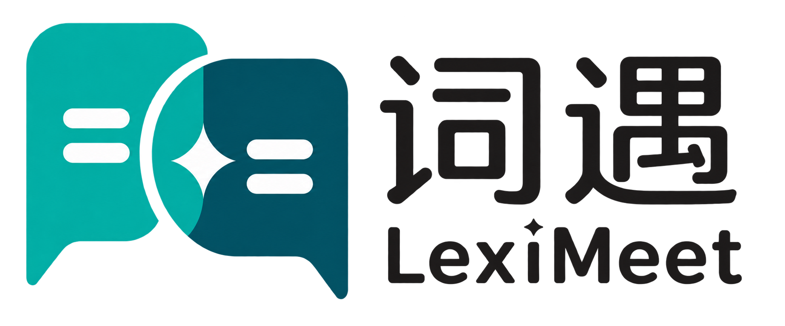
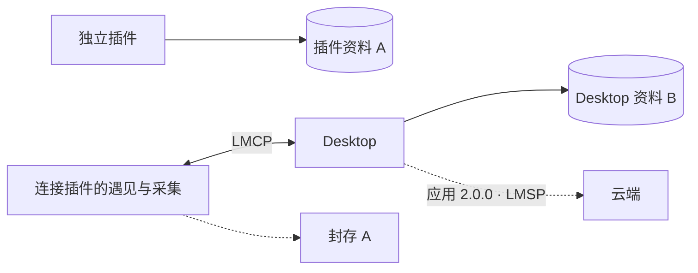

<p align="center">
  <picture>
    <source media="(prefers-color-scheme: dark)" srcset="docs/assets/logo-dark.png">
    
  </picture>
</p>

<h1 align="center">LexiMeet Connector Protocol</h1>

<p align="center">插件遇见与采集，桌面负责资料与学习。<br>一份有边界、可验证的本机接口合同。</p>

<p align="center">
  <a href="LICENSE"></a>
  
  
</p>

[GitHub](https://github.com/leximeet/leximeet-connector-protocol) · [Gitee](https://gitee.com/leximeet/leximeet-connector-protocol)

GitHub 与 Gitee 是平级的源码、贡献和发布入口，使用同一份合同与验证规则。版本、提交和发行附件的核对方式见[发布与维护](docs/发布与维护.md)。

LMCP 定义 **Desktop 向插件提供的本机 API**，以及插件可选提供给 Desktop 的宿主能力。仓库包含 Schema、方法表、图解和参考测试；消费端自行实现适配器，不依赖协议运行时 SDK。

当前正式合同与 API 均为 **1.0.0**，首次发行标签和 Release 名称均使用 **1.0.0**，不加 `v` 前缀，也不使用预发布标签。本机连接的应用组合、平台和消费物料范围见[验证范围](docs/验证范围.md)。本地归档和校验通过不表示远端 CI 或任一平台的发行附件已发布。

## 插件连接后发生什么

<!-- leximeet-diagram: figure-b335630551-01 -->
<picture>
  <source media="(prefers-color-scheme: dark)" srcset="docs/diagrams/rendered/figure-b335630551-01.dark.svg">
  
</picture>

<details>
<summary>查看和编辑 Mermaid 源码</summary>

[图源文件](docs/diagrams/figure-b335630551-01.mmd)



</details>
<!-- /leximeet-diagram -->

Browser 独立运行时提供完整的本地功能。连接后，独立资料 **A** 被封存，不会导入或合并到桌面；遇见读取 Desktop 的资料，新增采集 **C** 写入 Desktop。临时失联时不会改投 A，明确断开后才恢复原 A，Desktop 保留 B+C。插件的管理入口转到 Desktop，设置中只保留断开连接。

## 从哪里开始

| 你要做的事                  | 阅读入口                                                                        |
| --------------------------- | ------------------------------------------------------------------------------- |
| 理解两种形态和责任分工      | [架构与接入](docs/架构与接入.md)                                                |
| 实现连接、确认、失联和恢复  | [自动发现与邀请](docs/自动发现与连接邀请.md) · [连接与恢复](docs/连接与恢复.md) |
| 实现 DTO 和业务方法         | [接口规范](docs/接口规范.md) · [共享数据模型](docs/共享数据模型.md)             |
| 增加 Browser / IDE 宿主能力 | [可选宿主扩展](docs/双向宿主能力.md)                                            |
| 运行验证、贡献和发布        | [开发与验证](docs/开发与验证.md) · [发布与维护](docs/发布与维护.md)             |
| 查看后续方向                | [路线图](docs/路线图.md) · [完整文档](docs/文档索引.md)                         |

## 五分钟验证

```sh
npm ci --ignore-scripts
npm run format:check
npm run verify
```

需要 Node.js 22.12+。依赖安装后，验证完全离线，不启动应用、不读取个人数据库、不发送网络请求。测试覆盖结构、授权、事务回执、连接恢复、宿主权限及交付摘要；真实 Browser—Native Host—Desktop 链路在应用仓库验收。

## 机器合同

| 入口                                               | 内容                                         |
| -------------------------------------------------- | -------------------------------------------- |
| [contract.json](contract.json)                     | API 版本、能力、连接政策和交付身份           |
| [methods.json](methods.json)                       | 16 个必需方法、3 个可选方法                  |
| [schemas](schemas)                                 | 本机消息、Browser 扩展、词身份和公共词卡结构 |
| [fixtures/contracts.json](fixtures/contracts.json) | 正反请求和响应样例                           |
| [contract-manifest.json](contract-manifest.json)   | 17 项规范物料的原始字节摘要                  |

维护者运行 `npm run package:release`，从同一干净提交生成合同物料包、完整源码参考包、来源清单及 SHA-256。参考包包含本文档、开发工具与测试，合同物料包用于固定消费快照；均不是运行时 SDK。具体命令和两端冻结步骤见[发布与维护](docs/发布与维护.md)。

基础能力包括阅读、采集和导航；反向宿主方法由各扩展按实际支持情况逐项声明。协议不以通用 RPC 的方式开放远程练习、整库接管、任意脚本、文件或浏览器历史。

## 参与与安全

欢迎补充可复现问题、明确的规范修订和隔离测试。见 [贡献指南](CONTRIBUTING.md)、[行为准则](CODE_OF_CONDUCT.md)和[安全报告](SECURITY.md)。首次正式发布后保护真实用户资料；历史候选不提供双栈兼容。

## 参考与致谢

词身份与公共词卡来自 leximeet-dictionary 0.0.3（[GitHub](https://github.com/leximeet/leximeet-dictionary) / [Gitee](https://gitee.com/leximeet/leximeet-dictionary)）。感谢 [Chrome Native Messaging](https://developer.chrome.com/docs/extensions/develop/concepts/native-messaging)、[JSON Schema](https://json-schema.org/draft/2020-12)、[Ajv](https://ajv.js.org/) 与 [RFC 8785](https://www.rfc-editor.org/rfc/rfc8785)。品牌图为词遇项目物料；它们不授予冒用项目身份的权利。代码与文档许可见 [AGPL-3.0-only](LICENSE)。

统一文档源：[GitHub](https://github.com/leximeet/leximeet.github.io/tree/main/docs) / [Gitee](https://gitee.com/leximeet/leximeet.github.io/tree/main/docs) · [许可范围](docs/许可证.md)
