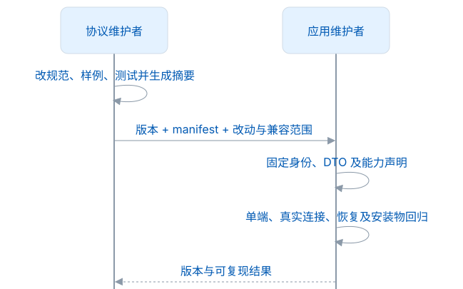
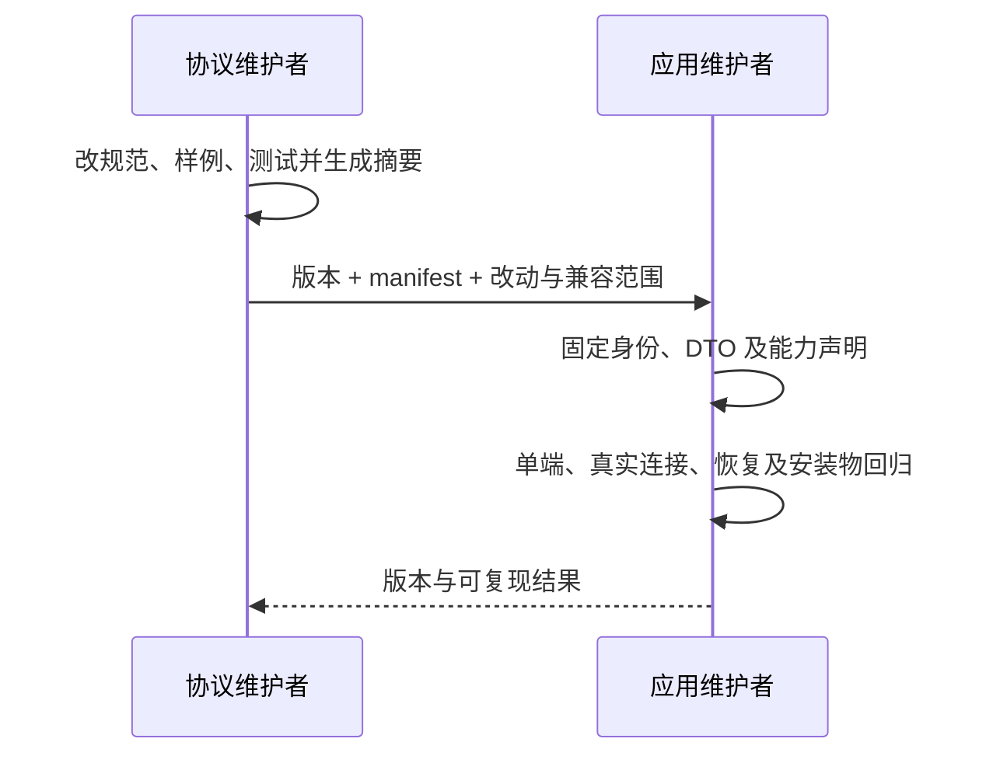

# 发布与维护

本仓正式版本为 1.0.0，首次 Git 标签和 Release 名称使用 `1.0.0`，不加 `v` 前缀，不标为 rc 或 prerelease。合同冻结、应用验收、本地发行物和远端发布分别记录：本地验证不能证明远端 Actions 已运行或 GitHub Release 已存在。

## 发布前检查

1. package.json、lockfile、contract.json 的版本一致；API 与合同身份是 1.0.0。
2. 运行 format:check、verify；确认 17 项规范、共享快照及生成摘要一致。
3. Desktop、Core、Browser 记录实际采用的合同来源与摘要，真实连接/采集/恢复与安装物回归通过；本轮私人字段删减后重新验收，旧组合与新结构按[验证范围](验证范围.md)区分。
4. 检查公开 HEAD、全部计划推送的 Git 历史、附件和许可证；首次公开历史保留远程已有的 `init` 提交，再在其上添加一次发布结果提交。
5. 准备当前 CHANGELOG、源码归档、contract-manifest.json 与 SHA-256。维护者明确批准后才打 tag 或发布。

仓库 CI 只验证，不自动推送、打 tag、上传 npm 或创建 GitHub Release。发布页面应列明准确的平台和限制，不把 macOS 通过等同于 Windows/Linux 安装已验收。

整理首次公开历史时保留 `init` 的原始提交身份，`1.0.0` 标签指向其后的发布结果提交。开发历史、旧候选标签与私有备份分别留存；历史记录中的旧名称仍表示当时的事实，不能把它们改写为新的正式标签。发布前再次核对远程 `init` 与最终提交的父子关系，不把尚未存在于公开历史的提交或标签当作可取得的来源。

## 生成和检查正式交付文件

需要 Node.js 22.12+、npm 和 Git。先提交并确认工作树干净，再在本仓根目录执行：

```sh
npm ci --ignore-scripts
npm run package:release
```

命令先执行格式检查和完整协议验证，再从精确的 Git 提交生成 `.runtime/release/1.0.0/<时间戳>/`。每轮使用新目录，已有目录不会被覆盖。输出如下：

| 文件                                                | 用途                                                                                                |
| --------------------------------------------------- | --------------------------------------------------------------------------------------------------- |
| `leximeet-connector-protocol-1.0.0-source.tar.gz`   | 完整已提交源码、文档、锁文件、参考实现和测试；开发者解压后可安装依赖并运行验证                      |
| `leximeet-connector-protocol-1.0.0-contract.tar.gz` | 合同配置、规范清单、共享来源、结构样例、17 项规范和许可；供消费端固定物料，不是独立文档或运行时 SDK |
| `RELEASE-MANIFEST.json`                             | 正式版本、无 `v` 前缀的 `releaseTag`、实际源码提交、合同与共享模型摘要、两个归档的字节数和 SHA-256  |
| `SHA256SUMS`                                        | 两个归档的下载校验和                                                                                |

可以指定一个不存在的输出目录；CI 使用同一入口：

```sh
npm run package:release -- .runtime/my-release
npm run verify:release -- .runtime/my-release
```

检查包内来源与 SHA-256 后，才将这些文件作为 `1.0.0` 的待上传附件。脚本不连接 GitHub、不创建标签或 Release、不上传 npm，也不收集 `node_modules`、忽略的本地环境和临时文件。源码包仍应经过维护者的公开内容审查；Git 归档不会自动判断已提交文件是否含秘密。

参考包可按以下步骤复验：

```sh
tar -xzf leximeet-connector-protocol-1.0.0-source.tar.gz
cd leximeet-connector-protocol-1.0.0
npm ci --ignore-scripts
npm run format:check
npm run verify
```

源码归档没有 `.git`，可以运行参考验证；重新生成有提交来源的发行物则应使用对应 Git checkout。

## 规范与消费端交接

<!-- leximeet-diagram: figure-e163c9e99f-01 -->
<picture>
  <source media="(prefers-color-scheme: dark)" srcset="diagrams/rendered/figure-e163c9e99f-01.dark.svg">
  
</picture>

<details>
<summary>查看和编辑 Mermaid 源码</summary>

[图源文件](diagrams/figure-e163c9e99f-01.mmd)



</details>
<!-- /leximeet-diagram -->

摘要位于 contract.json；逐文件哈希在 contract-manifest.json。不要在规范正文中手写摘要，以免造成自引用；消费端也不能复制运行时对端的摘要来代替自身实现。维护说明不参与摘要，规范行为必须留在显式规范文件。

contract.json 中 runtimeImplemented=false 说明本仓没有应用运行时；jointAcceptancePassed 不是消费端 CI 的实时结果。应用验收结果在各自仓库记录，不为改一个完成标记反复更换协商身份。

### 固定两端消费快照

1. 使用最终发布结果提交作为 `SOURCE`；正式 `1.0.0` 标签存在后，也可解析该标签取得实际提交。首次开源前整理历史后，应刷新各端来源记录，不能把已不在公开历史中的旧提交当作可取得的来源；尚未发布时不要声称标签或提交已可从远程取得。
2. Desktop 保持规范清单中的相对路径，固定 `contract.json`、`contract-manifest.json`、`shared-manifest.json`、`fixtures/contracts.json` 和全部 17 项规范；Browser 的扁平 Schema/样例目录按自身构建约定映射，但保存相同字节和来源记录。
3. 更新消费端固定摘要、DTO 和实际采集/词卡实现。当前私人结构只保留 `note`：不发送 `meaningSupplement` 的空值占位，不恢复个人释义或用户标签接口。公共 Dictionary 释义不受影响。
4. 严格结构验证应接受新 `{note}` 请求并拒绝旧字段。测试生产两端的笔记采集、重复提交、丢 ACK、重启恢复、临时失联和明确断开；源码与实际应用包分别记录。
5. 打包完成后再次核对冻结物料和源码来源。不同 `1.0.0` 候选曾有不同结构，只记录版本号不足以证明消费一致。

## 文档与验收记录维护

docs 与机器合同保存当前设计、使用方法、已验证范围和有效路线；根 README、CONTRIBUTING、SECURITY、LICENSE 保持托管平台的标准入口，无须重复搬进 docs。

整理旧资料时按主题提炼：把已实现的行为写入规范或开发说明，把与现行设计不冲突的想法写入路线图，并注明过时方案已被什么替代。应用 UI、学习规则、资源许可和云同步由各自维护仓接收，LMCP 不复制第二套正文。过程提示词、原始日志与私有配置不放进公开文档。

删除旧记录前，另外保留需要追溯的版本/平台/哈希及脱敏结果、源码与恢复备份。即使文档已经能够独立阅读，原始证据和其他项目资料仍可能有追溯价值。

## 版本发布后

正式用户资料保护从第一次 1.0.0 开始。升级要保留活动与封存库、稳定身份、事实、笔记、词本与未确认命令；升级失败应保留可恢复资料。维护者按兼容政策决定 minor/patch 或 major，不添加仅为未发布候选保留的双栈。
