# 规范图解手册

本页使用统一明暗图表展示现行规范中的流程，供阅读与讨论。节点形状仅为视觉表达；参数、权限和行为以链接的原始规范为准。冻结规范原始字节保持不变，图解不参与协商身份。

## browser · 图 1

规范依据：[原始正文](extensions/browser.md)。

<!-- leximeet-diagram: figure-1970c5a6ff-01 -->
<picture>
  <source media="(prefers-color-scheme: dark)" srcset="diagrams/rendered/figure-1970c5a6ff-01.dark.svg">
  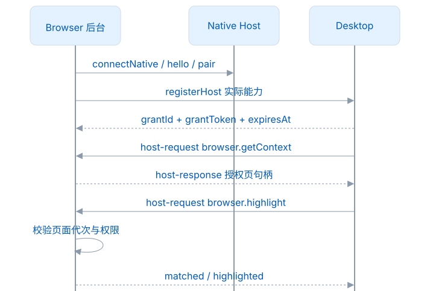
</picture>

查看和编辑 Mermaid 源码

[图源文件](diagrams/figure-1970c5a6ff-01.mmd)

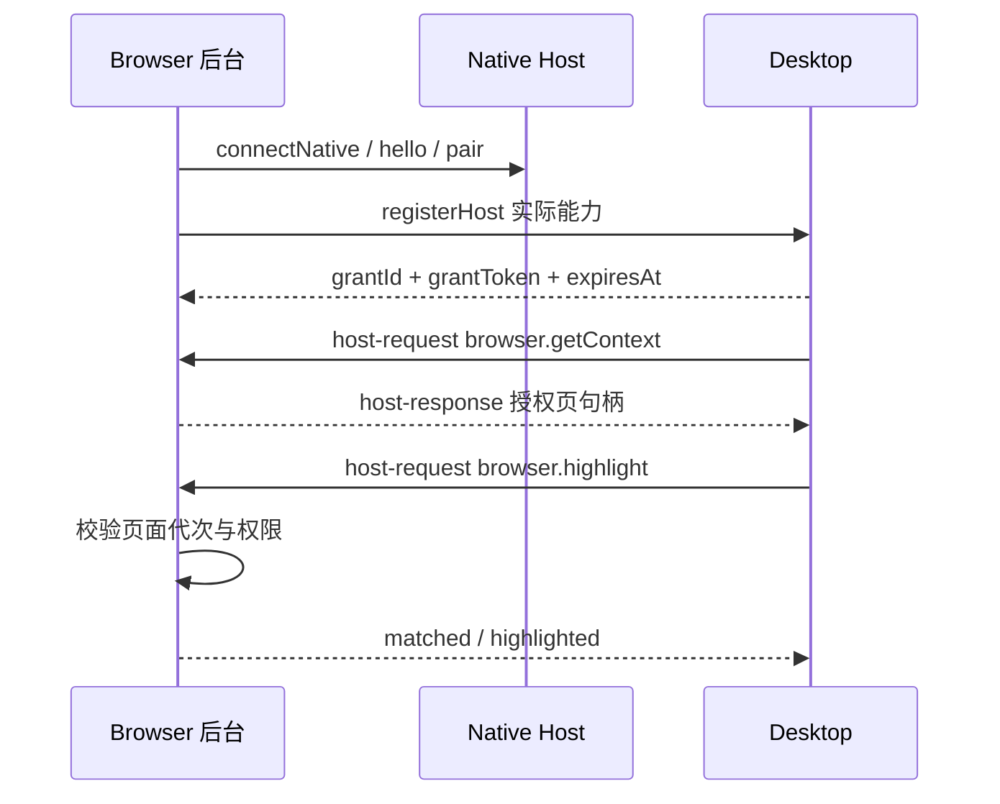

<!-- /leximeet-diagram -->

## 共享数据模型 · 图 1

规范依据：[原始正文](共享数据模型.md)。

<!-- leximeet-diagram: figure-57fc767aa7-01 -->
<picture>
  <source media="(prefers-color-scheme: dark)" srcset="diagrams/rendered/figure-57fc767aa7-01.dark.svg">
  
</picture>

查看和编辑 Mermaid 源码

[图源文件](diagrams/figure-57fc767aa7-01.mmd)

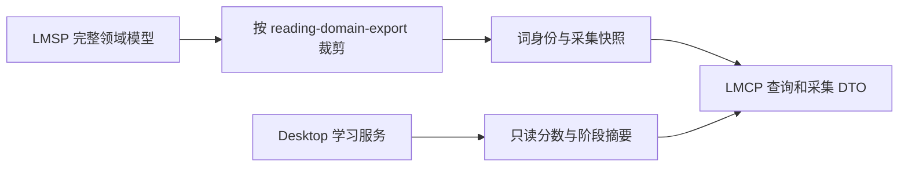

<!-- /leximeet-diagram -->

## 兼容与迭代 · 图 1

规范依据：[原始正文](兼容与迭代.md)。

<!-- leximeet-diagram: figure-2e8fe0e0ce-01 -->
<picture>
  <source media="(prefers-color-scheme: dark)" srcset="diagrams/rendered/figure-2e8fe0e0ce-01.dark.svg">
  
</picture>

查看和编辑 Mermaid 源码

[图源文件](diagrams/figure-2e8fe0e0ce-01.mmd)

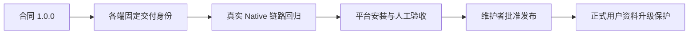

<!-- /leximeet-diagram -->

## 双向宿主能力 · 图 1

规范依据：[原始正文](双向宿主能力.md)。

<!-- leximeet-diagram: figure-d20331de2a-01 -->
<picture>
  <source media="(prefers-color-scheme: dark)" srcset="diagrams/rendered/figure-d20331de2a-01.dark.svg">
  
</picture>

查看和编辑 Mermaid 源码

[图源文件](diagrams/figure-d20331de2a-01.mmd)

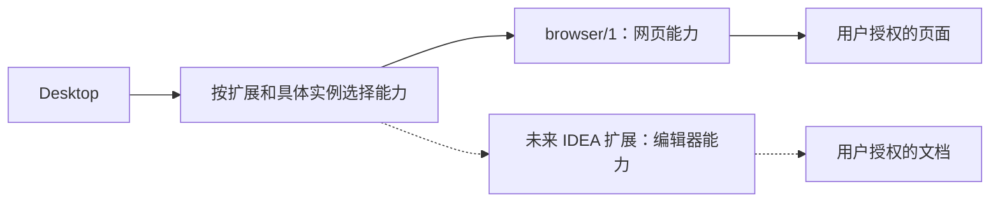

<!-- /leximeet-diagram -->

## 实现与验收 · 图 1

规范依据：[原始正文](实现与验收.md)。

<!-- leximeet-diagram: figure-07662899b6-01 -->
<picture>
  <source media="(prefers-color-scheme: dark)" srcset="diagrams/rendered/figure-07662899b6-01.dark.svg">
  
</picture>

查看和编辑 Mermaid 源码

[图源文件](diagrams/figure-07662899b6-01.mmd)

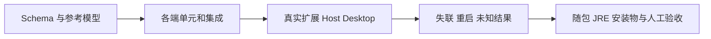

<!-- /leximeet-diagram -->

## 接口规范 · 图 1

规范依据：[原始正文](接口规范.md)。

<!-- leximeet-diagram: figure-c7641d758d-01 -->
<picture>
  <source media="(prefers-color-scheme: dark)" srcset="diagrams/rendered/figure-c7641d758d-01.dark.svg">
  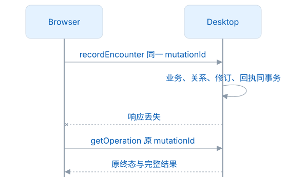
</picture>

查看和编辑 Mermaid 源码

[图源文件](diagrams/figure-c7641d758d-01.mmd)

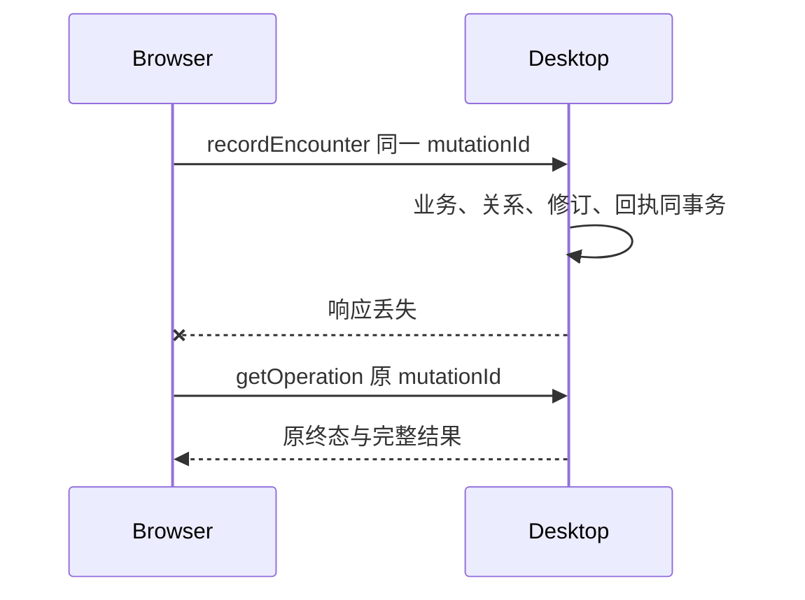

<!-- /leximeet-diagram -->

## 架构与接入 · 图 1

规范依据：[原始正文](架构与接入.md)。

<!-- leximeet-diagram: figure-6e3d4d33c1-01 -->
<picture>
  <source media="(prefers-color-scheme: dark)" srcset="diagrams/rendered/figure-6e3d4d33c1-01.dark.svg">
  
</picture>

查看和编辑 Mermaid 源码

[图源文件](diagrams/figure-6e3d4d33c1-01.mmd)

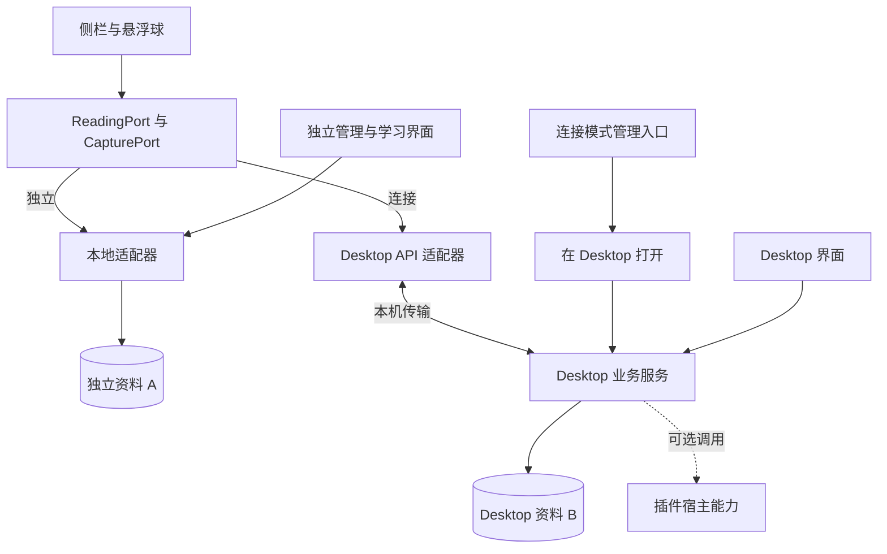

<!-- /leximeet-diagram -->

## 自动发现与连接邀请 · 图 1

规范依据：[原始正文](自动发现与连接邀请.md)。

<!-- leximeet-diagram: figure-78f83210b9-01 -->
<picture>
  <source media="(prefers-color-scheme: dark)" srcset="diagrams/rendered/figure-78f83210b9-01.dark.svg">
  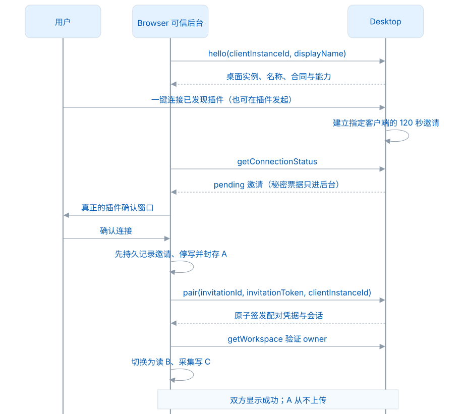
</picture>

查看和编辑 Mermaid 源码

[图源文件](diagrams/figure-78f83210b9-01.mmd)

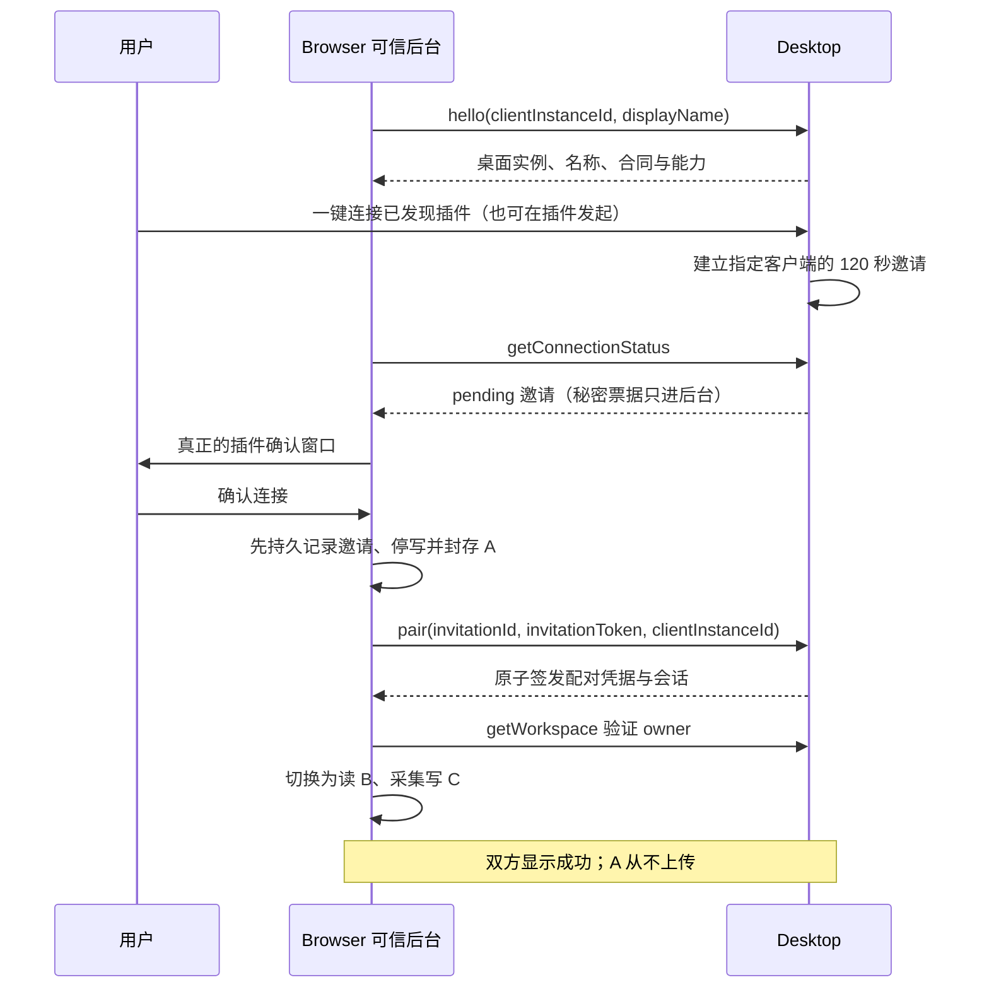

<!-- /leximeet-diagram -->

## 自动发现与连接邀请 · 图 2

规范依据：[原始正文](自动发现与连接邀请.md)。

<!-- leximeet-diagram: figure-78f83210b9-02 -->
<picture>
  <source media="(prefers-color-scheme: dark)" srcset="diagrams/rendered/figure-78f83210b9-02.dark.svg">
  
</picture>

查看和编辑 Mermaid 源码

[图源文件](diagrams/figure-78f83210b9-02.mmd)

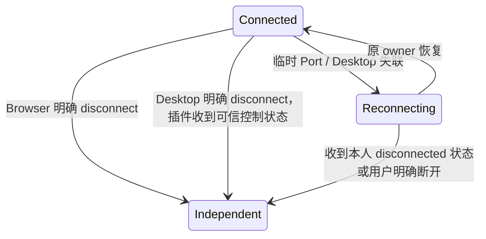

<!-- /leximeet-diagram -->

## 连接与恢复 · 图 1

规范依据：[原始正文](连接与恢复.md)。

<!-- leximeet-diagram: figure-bc12d63a54-01 -->
<picture>
  <source media="(prefers-color-scheme: dark)" srcset="diagrams/rendered/figure-bc12d63a54-01.dark.svg">
  
</picture>

查看和编辑 Mermaid 源码

[图源文件](diagrams/figure-bc12d63a54-01.mmd)

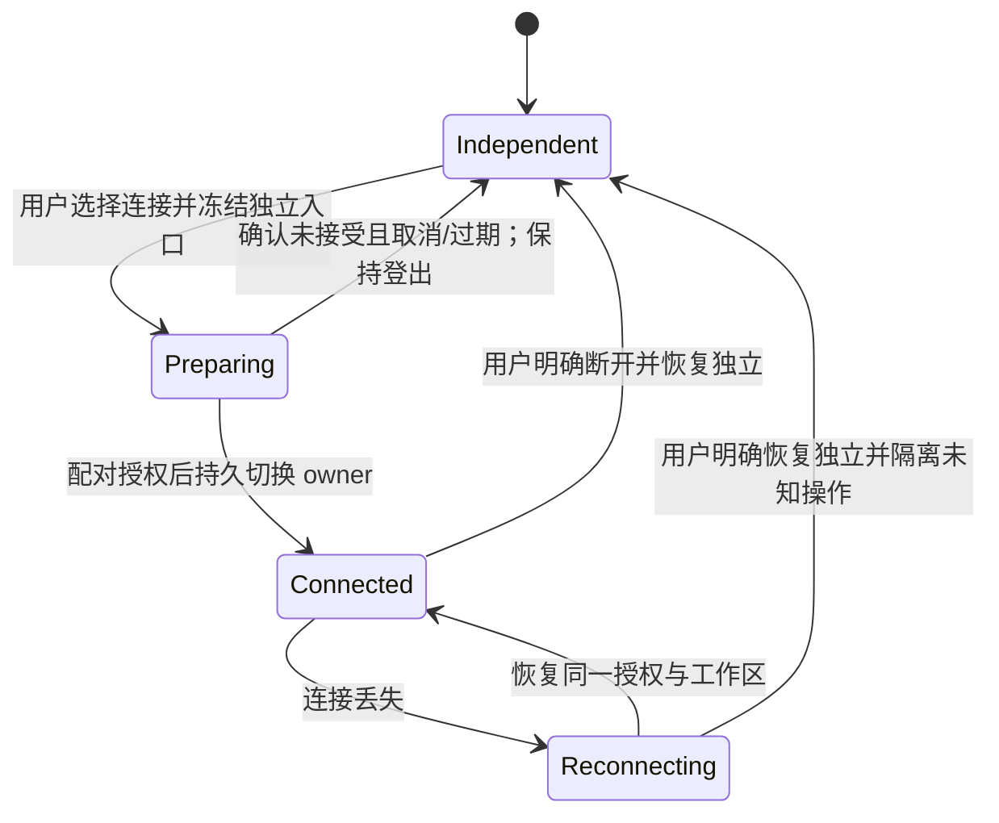

<!-- /leximeet-diagram -->

## 连接与恢复 · 图 2

规范依据：[原始正文](连接与恢复.md)。

<!-- leximeet-diagram: figure-bc12d63a54-02 -->
<picture>
  <source media="(prefers-color-scheme: dark)" srcset="diagrams/rendered/figure-bc12d63a54-02.dark.svg">
  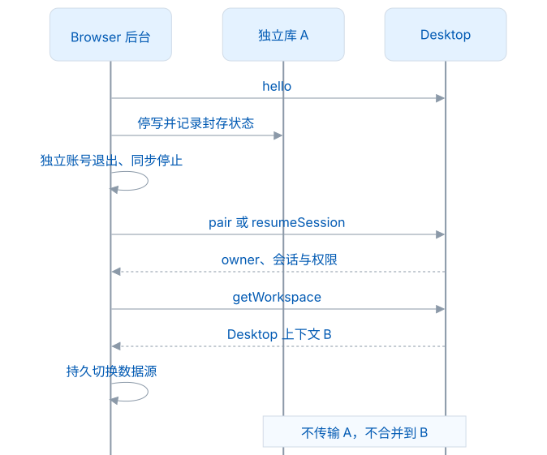
</picture>

查看和编辑 Mermaid 源码

[图源文件](diagrams/figure-bc12d63a54-02.mmd)

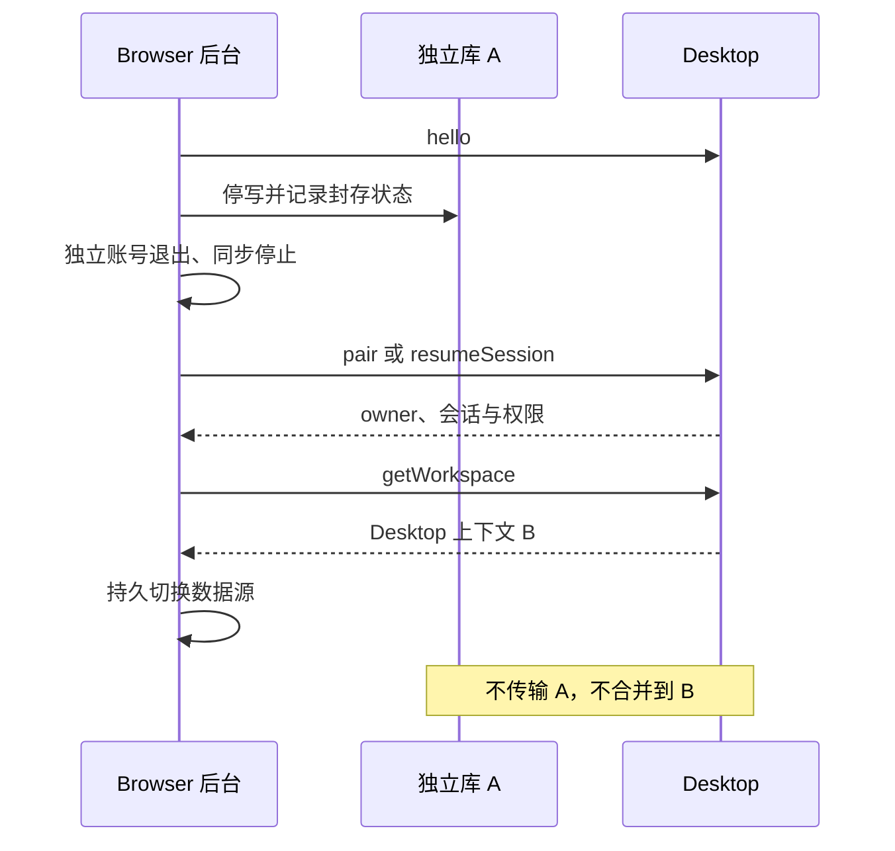

<!-- /leximeet-diagram -->

## 配对与契约身份 · 图 1

规范依据：[原始正文](配对与契约身份.md)。

<!-- leximeet-diagram: figure-749eb5932c-01 -->
<picture>
  <source media="(prefers-color-scheme: dark)" srcset="diagrams/rendered/figure-749eb5932c-01.dark.svg">
  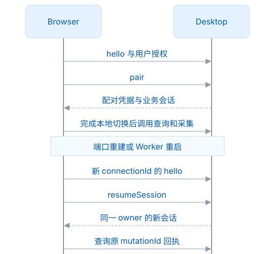
</picture>

查看和编辑 Mermaid 源码

[图源文件](diagrams/figure-749eb5932c-01.mmd)

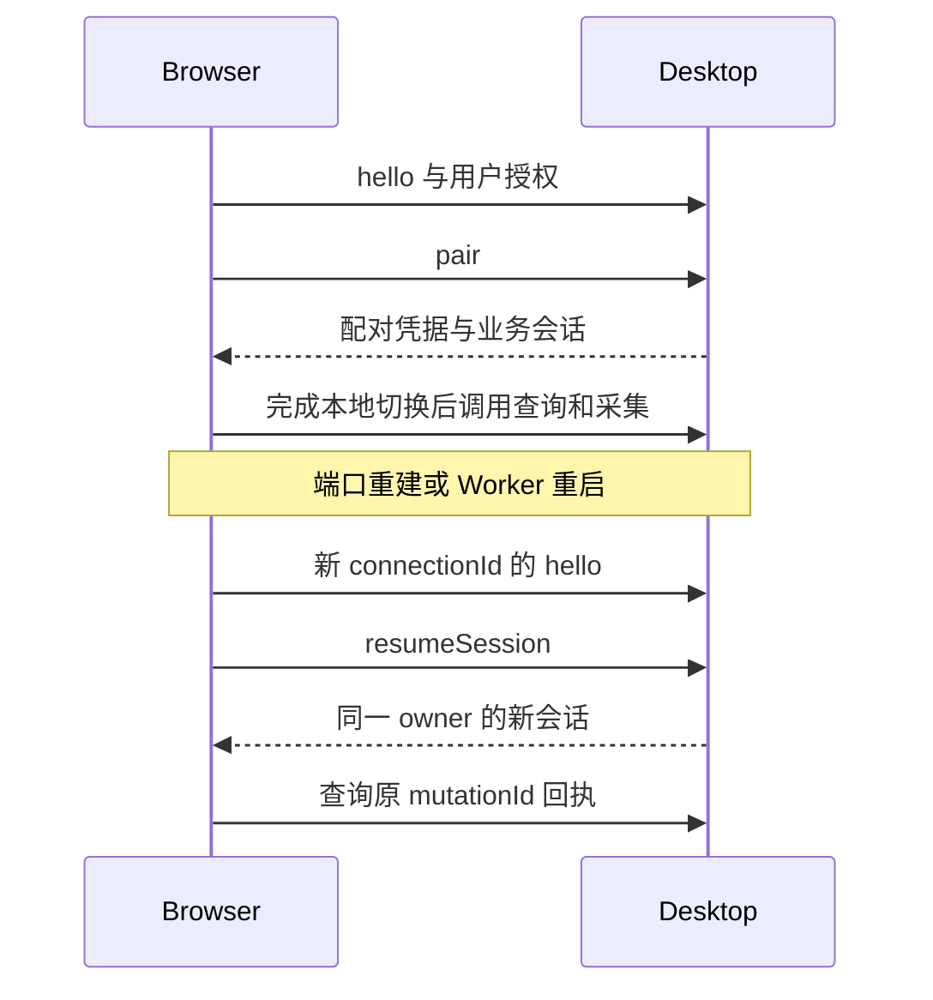

<!-- /leximeet-diagram -->
