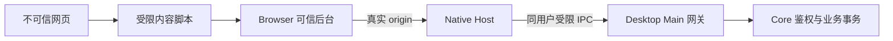

# 安全与隐私

## 信任边界

<!-- leximeet-diagram: figure-e91ef97771-01 -->
<picture>
  <source media="(prefers-color-scheme: dark)" srcset="diagrams/rendered/figure-e91ef97771-01.dark.svg">
  
</picture>

查看和编辑 Mermaid 源码

[图源文件](diagrams/figure-e91ef97771-01.mmd)

<!-- /leximeet-diagram -->

页面不能接触 invitationToken、pairingToken、sessionToken、grantToken 或桌面云凭据。真实 origin 来自传输，不采用消息自报身份。Host 不开放任意文件、SQL、JavaScript 或通用本机 HTTP 代理。

发现与通知只显示安全名称、ID 和状态。配对由真实插件窗口确认，秘密只由可信后台与服务端处理；服务端存哈希。日志、URL、截图、公开问题和测试报告都不能包含秘密或原始用户资料。

## 语境采集

LMCP 规定消息上限与安全结构，实际产品采用更窄的采集策略：默认一个命中句子、500 个 UTF-16 单元、内置规则脱敏为 xxx、相同词身份与安全语境七天去重。连接模式由 Desktop 统一处理，插件不能用本地偏好绕过。

脱敏是降低意外泄露风险的内置规则，不能识别所有业务秘密；用户仍应避免采集机密资料。正文不是遥测字段，错误日志不记全文。http/https 来源去除账号密码与 fragment；不上传 cookie、浏览器历史、表单或全文。

## 失败与恢复

超时不能证明操作未提交。查询回执或重试时应沿用同一 mutationId，不能更换 ID 重做；工作区或授权变更后，旧命令也不能写入新的资料。临时失联时锁定私人缓存，并保持 A 封存；明确断开后才恢复独立模式。

漏洞报告方式见 [SECURITY.md](../SECURITY.md)。测试使用纯合成资料，密钥生成在临时环境，日志只记结果与单向摘要。
