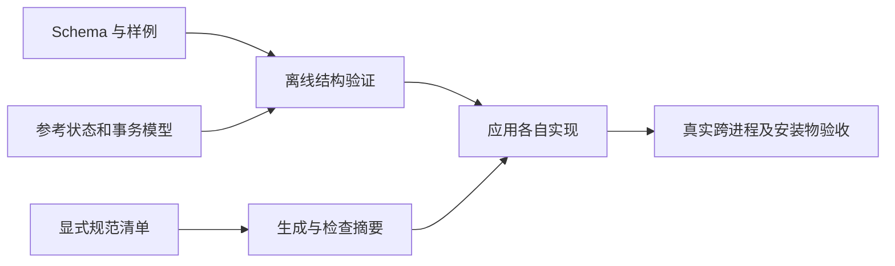

# 开发与验证

## 获取源码

[GitHub](https://github.com/leximeet/leximeet-connector-protocol) 与 [Gitee](https://gitee.com/leximeet/leximeet-connector-protocol) 提供同一项目的源码入口。选择任一平台获取代码后使用以下命令；接入生产应用时固定精确提交、合同摘要与物料来源，不能只依赖可变的 main。

## 本地命令

```sh
npm ci --ignore-scripts
npm run format:check
npm run verify
# 只调整工具、测试与维护文档格式
npm run format
# 修改规范后，明确重建交付身份
npm run contract:generate
# 从干净提交生成正式合同和源码参考包
npm run package:release
# 检查指定发行目录，不连接远程托管平台
npm run verify:release -- .runtime/my-release
```

Node.js 最低 22.12。依赖仅用于开发验证，使用 package-lock.json 安装；没有运行时 SDK 或跨仓加载。安装依赖后，验证过程离线运行，不触碰应用资料。

## 工程结构

| 目录                            | 用途                                 |
| ------------------------------- | ------------------------------------ |
| schemas/                        | JSON Schema 2020-12，离线编译        |
| methods.json、host-methods.json | 正向白名单和可选宿主方法             |
| fixtures/                       | 请求/响应正反样例                    |
| tools/                          | 摘要、结构校验、内存参考实现         |
| tests/                          | 事务、连接、邀请、宿主权限及摘要测试 |
| docs/                           | 当前规范与开发者说明                 |

Prettier 管理 CommonJS、YAML 和非规范文档。17 项已冻结规范排除自动格式化，因为排版也是交付字节的一部分。不要用批量格式化绕过合同版本审查。

## CI 检查什么

GitHub Actions 在 Node.js 22、24 下执行锁定依赖安装、格式检查、完整 verify 和正式归档，采用只读仓库权限与明确超时。main、无 `v` 前缀的版本标签或人工触发均运行同一检查；首次正式标签为 `1.0.0`。成功时上传合同与源码参考包供维护者核对。相同分支的新运行会取消旧运行。Actions 不创建 tag、推送或发布。

Gitee 尚未配置随仓流水线，从 Gitee 获取源码仍使用同一套本地命令。平台平级不表示两处都已经运行 CI；发布前核对精确提交对应的实际结果，见[发布与维护](发布与维护.md)。

verify 包括：Schema 严格离线编译、方法/样例对应、字段和预算、共享快照哈希、规范摘要、文档链接/围栏、参考行为测试。摘要测试验证新增维护文档不改身份、每项规范字节变化都改身份；归档测试检查干净提交、忽略项、禁止覆盖、身份与文件篡改，并要求清单 `releaseTag` 与正式版本一致。打包必须来自同一干净提交，归档前后的来源变化会导致失败。

邀请测试校验消息结构和控制状态枚举；邀请的持久事务、票据重放及原生确认窗口由消费端测试验证。会话/资料路由参考模型只说明对应边界，不能直接当成生产配对服务。当前实际范围见[验证范围](验证范围.md)。

## 常见接入问题

| 现象                            | 检查入口                                                                                                                      |
| ------------------------------- | ----------------------------------------------------------------------------------------------------------------------------- |
| hello 没有到达 Desktop          | 先检查消费端的 Native Host 安装、实际扩展来源与 Desktop 运行状态；本仓 npm verify 不安装 Host                                 |
| 尚未配对，如何请求连接          | requestConnection、getConnectionStatus 不要求业务会话，但仍受真实来源/客户端身份约束；见[方法索引](接口规范.md#方法索引)      |
| 已发现设备却没有自动连接        | 发现只提供安全元数据；连接须在真正的插件窗口确认，见[邀请流程](自动发现与连接邀请.md)                                         |
| 采集超时，不确定是否已保存      | 保留原 owner、eventId、mutationId 和载荷，查询原 getOperation；不要换 ID 或改投独立库，见[回执规则](接口规范.md#帧授权与回执) |
| getChanges 未变化但学习分数变化 | 修订与时间投影分别刷新，见[读取与刷新](架构与接入.md#读取与刷新)                                                              |
| 未登记反向宿主能力              | 基础遇见与采集仍可用；按实际能力接入[可选扩展](双向宿主能力.md)                                                               |

<!-- leximeet-diagram: figure-c92284f1ee-01 -->
<picture>
  <source media="(prefers-color-scheme: dark)" srcset="diagrams/rendered/figure-c92284f1ee-01.dark.svg">
  
</picture>

<details>
<summary>查看和编辑 Mermaid 源码</summary>

[图源文件](diagrams/figure-c92284f1ee-01.mmd)



</details>
<!-- /leximeet-diagram -->

本仓不启动 UI，端到端运行由应用仓验证。真实 Native Messaging、Main、Core 与 SQLite 测试的结果，才能证明对应应用链路可用。提交问题时标明它发生在哪层，附最小复现与脱敏结果。
