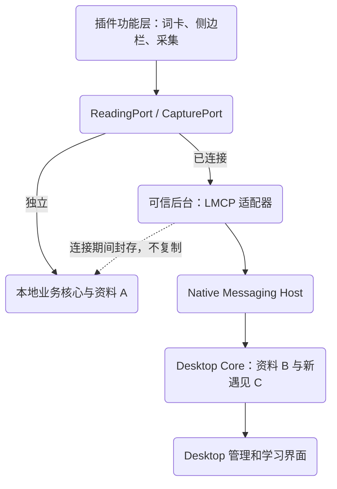
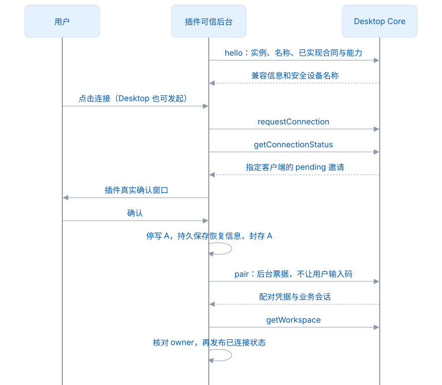
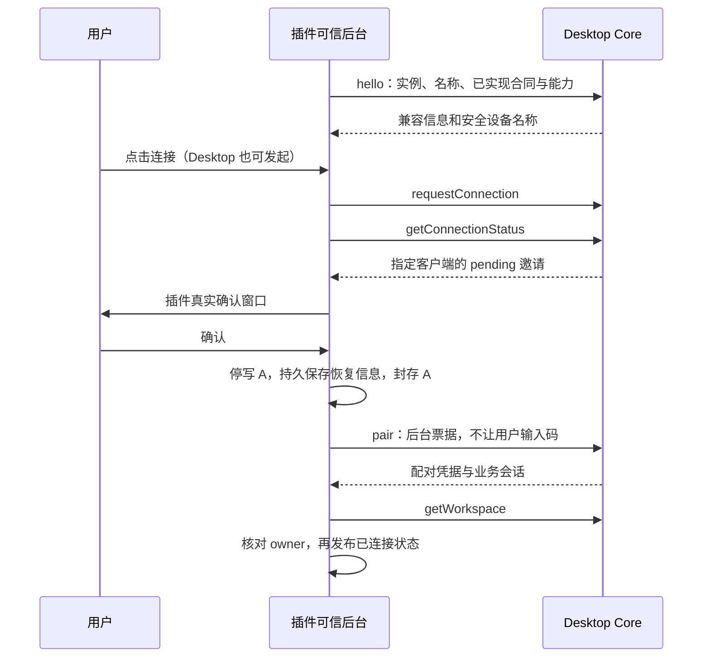
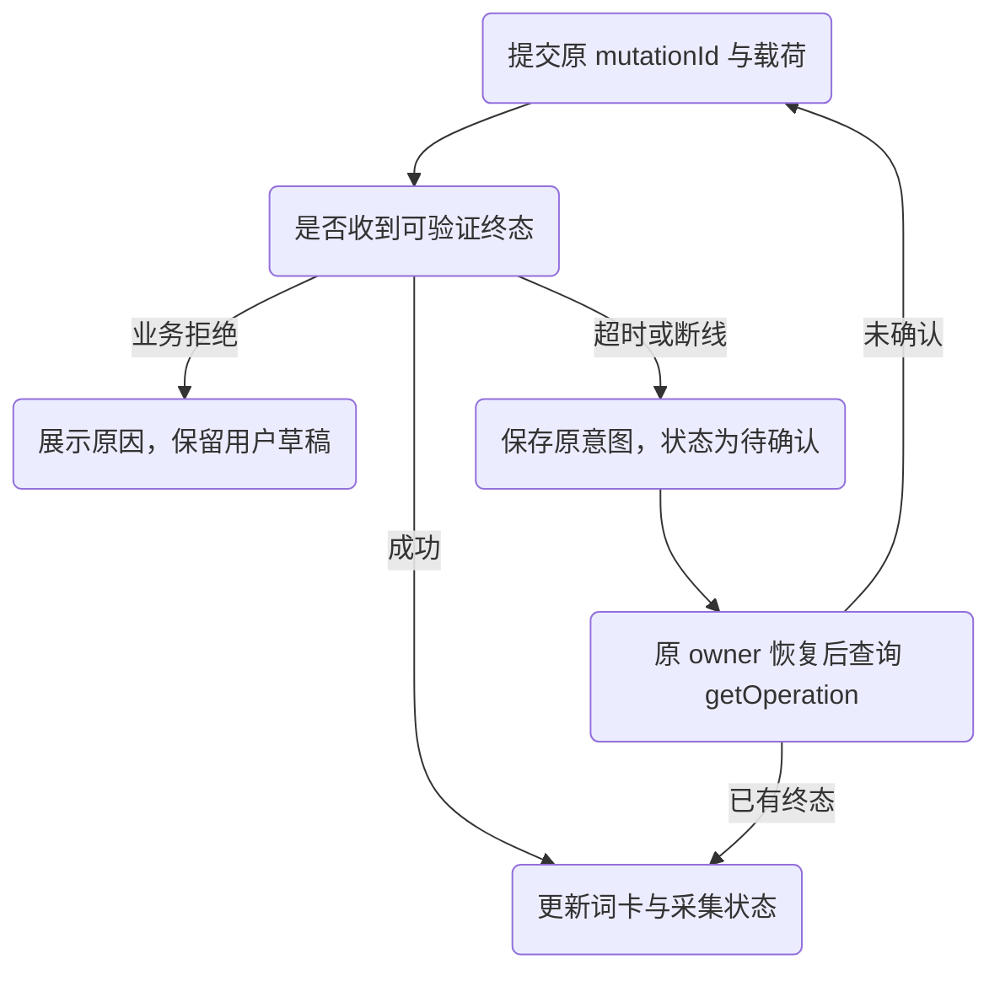

# 从独立插件接入 Desktop

本页按接入步骤解释已经冻结的 LMCP 1.0.0 合同，帮助实现者从代码分层走到真实采集。它是解释性指南，参数、权限和状态以[接口规范](接口规范.md)、[连接与恢复](连接与恢复.md)和 [Schema](../schemas/desktop-api.v1.schema.json)为准；不增加方法，也不改变合同摘要。

## 一次连接替换哪一层

插件的悬浮词卡、侧边栏、文本匹配和采集按钮继续运行在宿主内。独立时，它们调用本地业务核心；连接时，调用 Desktop 的读取/采集适配器。管理、规划、练习和个人资料编辑在 Desktop 完成，插件管理页提供跳转与断开入口。

<!-- leximeet-diagram: figure-c37e5cffd9-01 -->
<picture>
  <source media="(prefers-color-scheme: dark)" srcset="diagrams/rendered/figure-c37e5cffd9-01.dark.svg">
  
</picture>

<details>
<summary>查看和编辑 Mermaid 源码</summary>

[图源文件](diagrams/figure-c37e5cffd9-01.mmd)



</details>
<!-- /leximeet-diagram -->

这与替换后端接口类似，但不能把状态切换只写成一个布尔值。在途采集、缓存、邀请恢复和账号任务，都需要继续绑定原资料身份。**临时失联保持连接形态，只停止依赖 Desktop 的读写；用户明确断开才恢复 A。**

## 第一步：在核心边界准备适配器

在功能层列出需要的最小操作：候选匹配、读取词卡、采集语境、查看写入结果、打开 Desktop。对应方法分别为 `matchWords`、`getWord` / `getPublicEntry`、`recordEncounter`、`getOperation`、`openInDesktop`。

UI 只提交当前词的稳定身份、句子和用户输入。熟练度由 Desktop 计算，UI 不直接写 Desktop 表，也不把插件本机账号赋给 Desktop 会话。完整的规划和练习 CRUD **不是**连接插件的职责。需要 Desktop 调用浏览器页面能力时，另外注册有边界的 `browser.*` 宿主能力，不能把浏览器任意脚本执行暴露出去。

推荐适配器在返回 UI 数据前检查：当前运行形态、连接代次、工作区 owner 和请求目标。旧请求即使成功，也不能更新已经切回独立的词卡。资料 A 的封存应当先完成，再发送配对；不能一边继续向 A 写入，一边把 UI 指向 B。

## 第二步：发现、确认与切换

<!-- leximeet-diagram: figure-c37e5cffd9-02 -->
<picture>
  <source media="(prefers-color-scheme: dark)" srcset="diagrams/rendered/figure-c37e5cffd9-02.dark.svg">
  
</picture>

<details>
<summary>查看和编辑 Mermaid 源码</summary>

[图源文件](diagrams/figure-c37e5cffd9-02.mmd)



</details>
<!-- /leximeet-diagram -->

发现只是知道“有可连接的设备”。它不授权查看词卡，不导入 A，也不能静默接受另一端发起的连接。`pair` 的用户确认必须在真实插件窗口。秘密票据、配对凭据和会话 token 只留可信后台；通知、内容脚本和截图只展示安全名称与状态。

接口表中的“无需业务会话”不是“任何调用者都可用”。这些方法仍受真实 origin、当前 hello 登记、指定客户端和票据检查。Native Host 的 origin 来自传输，而不是插件自报的 JSON 字段。

## 第三步：采集一条真实语境

以页面 `Plants use photosynthesis.` 为例：插件识别原始词形，调用 Desktop 匹配候选，确定 `entryId` 后截取所在句子。脱敏和裁剪发生在保存之前；保存文本变化时重新计算其 UTF-16 范围，不能沿用原偏移。

`recordEncounter` 请求中的几组值承担不同责任：

| 值                                  | 意义                       | 实现注意                                       |
| ----------------------------------- | -------------------------- | ---------------------------------------------- |
| `requestId`                         | 一次传输请求               | 每次重试可换新值，用来关联响应                 |
| `mutationId`                        | 用户的一次业务意图         | 未确认时重试保持原值与原载荷                   |
| `eventId`                           | 一条遇见事件身份           | 不因响应丢失重新生成事件                       |
| `word.entryId`                      | 公共词条稳定身份           | 来自 Desktop 候选，不是页面拼写 hash           |
| `originalSentence` / `savedExcerpt` | 提交语境与保存摘录         | 分别带自己的有效范围                           |
| `source`                            | 受约束来源                 | 网页 URL 不携带用户名、密码或 fragment         |
| `collectionIntent`                  | 收集私人词与语境的业务意图 | 连接插件使用 `collect`，不能冒用桌面剪贴板策略 |

仓库维护了完整且可校验的请求与响应，可直接读取，无需手工重新拼装样例。在仓库根目录读取：

```sh
node -e 'const f=require("./fixtures/contracts.json"); console.log(JSON.stringify(f.find(x=>x.name==="recordEncounter-request").value,null,2))'
```

此样例中的 token 和设备 ID 是测试值，不是可用于连接真实服务的凭据。Desktop 校验身份、文本、范围和私人覆盖后，将遇见、必要关系、工作区修订和回执放在同一业务事务中提交，再返回结果。插件收到终态后才能显示“已采集”。

“同一 mutation 重试只提交一次”与“7 天内相同词语境不再采集”是两种机制：前者是协议幂等，后者是 Desktop 业务去重策略。客户端应如实显示服务端结果，不能为了看起来成功就先增加本地遇见数量。

## 第四步：处理结果未知

<!-- leximeet-diagram: figure-c37e5cffd9-03 -->
<picture>
  <source media="(prefers-color-scheme: dark)" srcset="diagrams/rendered/figure-c37e5cffd9-03.dark.svg">
  
</picture>

<details>
<summary>查看和编辑 Mermaid 源码</summary>

[图源文件](diagrams/figure-c37e5cffd9-03.mmd)



</details>
<!-- /leximeet-diagram -->

超时说明没有收到答案，不能证明 Desktop 没写入。不要换 `mutationId` 重做；否则同一次点击可能变成两个事件。同一 ID 换载荷会被 `IDEMPOTENCY_KEY_REUSED` 拒绝。当前 owner 已失效时不能为了查询旧回执越权恢复；原意图应隔离在其所属资料，不能改投另一个账号或本地 A。

## 缓存刷新与双向能力

`matchWords` 和 `getWord` 的分数/状态是 Desktop 在 `asOf` 时计算的展示值，租期受 `refreshAfterMs` 约束。状态可能因时间衰减变化，即使没有新事件也不能无限缓存。`getChanges` 用来使读取缓存失效，不是云同步事件日志。

`registerHost` 是可选能力。Browser 可按已授权页面提供读取选区、定位词和打开来源；IDEA/WPS 未来可暴露不同能力。不声明就不能调用，撤权或页面切换后重新验证 grant。宿主动作的回执与采集回执分开管理。详见[双向宿主能力](双向宿主能力.md)。

## 接入是否完成的验收表

| 场景                         | 必须观察的真实结果                               |
| ---------------------------- | ------------------------------------------------ |
| 双方发起/确认/取消           | 真插件窗口；双方状态一致；取消不封存成永久死状态 |
| 悬浮球与侧边栏采集           | Desktop 实际增加预期事件、关系和私人覆盖；A 不变 |
| ACK 丢失、快速重复点击       | 回执恢复后只写一次，界面可继续                   |
| 临时断线与明确断开           | 前者不写 A；后者恢复 A，不回滚 B+C               |
| 旧请求迟到                   | 不能污染另一工作区或另一运行代次                 |
| 同拼写不同身份、缺失公共资源 | 不随机重建身份，不静默丢用户语境                 |
| 宿主能力未声明/已撤权        | 明确不可用，不退化成任意脚本调用                 |

结构样例和内存参考测试是接入前检查；完成这张表仍需要真正运行 Desktop、插件、Native Host。平台和验收来源见[验证范围](验证范围.md)。
