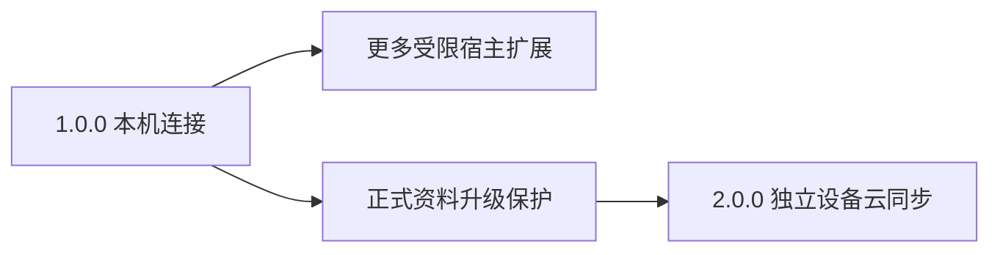

# 路线图

## 1.0.0 的确定范围

- 插件独立运行或连接 Desktop，两种核心适配器共用遇见与采集界面。
- 安全发现、双方可发起邀请、真实插件确认、自动配对、同 owner 恢复。
- 基础读取、原子采集、桌面导航、任一端明确断开；A 本机封存，不导入合并。
- 可选词本/遇见只读列表和 Browser 宿主扩展，按实际能力授权。

## 后续可独立推进

| 方向                      | 开始条件                     | 完成标准                                                          |
| ------------------------- | ---------------------------- | ----------------------------------------------------------------- |
| IDEA、VS Code、WPS 等插件 | 对应宿主有真实读写场景       | 独立命名空间、Schema、权限、传输绑定和宿主验收                    |
| 完善 Browser 可选宿主能力 | 能遵守页面授权和用户手势限制 | 当前能力声明、真实动作、回执恢复和权限收窄测试                    |
| 更及时的刷新提示          | 有可测性能需求               | 仅提示重查，不复制整库或取消有界轮询恢复                          |
| 更多浏览器和操作系统      | 有可安装的 Host 与应用包     | 真实来源、注册/卸载、断线和安装物矩阵                             |
| 应用 2.0.0 登录与云同步   | 云服务和 LMSP 消费端准备好   | 独立 Browser 与 Desktop 作为两台设备，同步正式 1.0.0 资料且不丢失 |

### 后续宿主的具体场景

以下是待开发场景，尚未定义新的扩展或证明原生宿主可用。它们复用阅读与采集核心，各自实现宿主适配，不要求照搬 Browser 的 DOM 能力。

| 宿主           | 优先场景                                                                | 实施时保留的边界                                                                                         |
| -------------- | ----------------------------------------------------------------------- | -------------------------------------------------------------------------------------------------------- |
| IDEA / VS Code | 主动分析当前文件或选中行；区分注释、Markdown 与标识符；点击词项定位来源 | 扩大到项目范围须明确选择并可取消；标识符命中不伪装成自然语言例句；输入只在插件控件中进行，不截获代码输入 |
| WPS Word       | 阅读选区及所在段落，在停靠窗格查词、确认采集、主动定位原文              | 读取与分析不修改文档正文、格式、撤销栈或自动保存；文档切换和编辑后重新验证来源位置                       |
| WPS PDF        | 先提供用户主动粘贴摘录并填写页码的入口；原生选词、页码回跳另行验证      | 不从 Word 能力推断 PDF 能力；扫描件/OCR、复制权限与受保护文件分别评估；不默认监听系统剪贴板              |

相应插件需要分别验收编辑器勿扰交互、明暗主题、键盘和输入法。文档来源定位应采用宿主自己的受限引用，不能把本机文件路径当成当前 Browser 扩展的网页 URL。连接后的练习和资料管理仍使用 Desktop。

<!-- leximeet-diagram: figure-960d46a5b9-01 -->
<picture>
  <source media="(prefers-color-scheme: dark)" srcset="diagrams/rendered/figure-960d46a5b9-01.dark.svg">
  
</picture>

查看和编辑 Mermaid 源码

[图源文件](diagrams/figure-960d46a5b9-01.mmd)

<!-- /leximeet-diagram -->

云同步独立于本机连接：独立 Browser 可以自己登录同步，连接 Browser 停止自己的账号与云任务，仅展示 Desktop 上下文，不接收桌面云 token。登录不等于自动上传。连接时的 A 不改绑到 Desktop 账号。完整同步规则由 LMSP 维护，不复制到 LMCP。

旧原型的整库接管、首次导入合并、连接后远程练习/管理、插件只缓存且必须安装桌面端，均与当前范围冲突，不继续作为待办。自动更新服务、输入法或 AI 插件等产品想法须独立评估，不扩大基础 LMCP 为通用 RPC。
