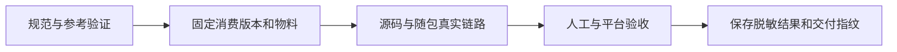

# 1.0.0 验证范围

记录日期：2026-10-06。本页是正式 1.0.0 的验收摘要与维护说明，不改变方法、Schema 或运行期兼容规则。本地结果与远端 Actions、GitHub Release 分别记录。

## 已确认的范围

| 层次           | 结果                                                                         | 能说明什么                                                             |
| -------------- | ---------------------------------------------------------------------------- | ---------------------------------------------------------------------- |
| 本仓结构与规范 | 4 个 Schema、92 个定义、126 个正反样例通过                                   | 请求/响应、19 个桌面方法、7 个可选反向方法与固定物料自洽               |
| 本仓参考测试   | 48 项通过：41 项会话/路由/采集/宿主/邀请/摘要检查，7 项真实 Git 发行归档检查 | 对应参考边界与来源归档成立；不是生产 Core 或原生 UI 运行证明           |
| 消费端物料     | 版本为 1.0.0；各端需记录当前实际来源和摘要，新结构的完整消费组合待验收       | 来源可核对，不在运行时读取相邻开发仓库                                 |
| 历史应用链路   | 旧消费组合记录了 macOS arm64 源码链及随包 JRE 链各 8 场连接通过              | 该组合的真实 Browser → Native Host → Main → Core，不覆盖本次新字段结构 |
| 历史人工验收   | 此前日常与双端测试已确认通过；当前新结构需重新验收                           | 对应历史组合的人工体验完成，不外推新消费组合和未测平台                 |

本仓本轮验证环境为 Node.js 25.2.1、npm 11.6.2。Actions 配置 Node.js 22、24；远程执行结果需另行记录。Browser 目前未登记网页反向能力，基础连接验收不表示七个反向方法已在生产插件中实现。

本次将 LMCP 私人词卡与采集 annotation 收敛为 {note}，与应用移除个人释义和自定义标签的设计对齐。合同自洽检查已通过，但这不能证明消费应用已经完成全部调整；旧消费副本和旧人工验收结果不覆盖本次新结构。当前 Browser 与 Desktop 的新组合仍需完成源码链、随包链及人工验收，发布协议物料不表示该组合已通过。

## 来源与可复验入口

| 项目    | 仓内结果页                                   | 入口                                                 |
| ------- | -------------------------------------------- | ---------------------------------------------------- |
| LMCP    | 本页、开发与验证                             | npm run format:check、npm run verify                 |
| Desktop | docs/测试与CI.md、docs/日常使用与升级测试.md | scripts/test-background.sh；源码与实际应用包分别验收 |
| Browser | docs/测试与验收.md、docs/发布指南.md         | npm run verify、npm run test:connected               |
| Core    | docs/发布与验收.md、docs/开发与测试.md       | 真实事务与 HTTP 测试，由 Desktop 随包链复验          |

消费端仓库分别为 [Desktop](https://github.com/leximeet/leximeet-desktop)、[Browser](https://github.com/leximeet/leximeet-browser) 和 [Core](https://github.com/leximeet/leximeet-desktop-core)。运行参数、隔离资料和最新平台矩阵以对应版本的仓内结果页为准。

<!-- leximeet-diagram: figure-fe6ecce616-01 -->
<picture>
  <source media="(prefers-color-scheme: dark)" srcset="diagrams/rendered/figure-fe6ecce616-01.dark.svg">
  
</picture>

查看和编辑 Mermaid 源码

[图源文件](diagrams/figure-fe6ecce616-01.mmd)

<!-- /leximeet-diagram -->

### 旧验收组合与当前交付身份

上述应用验收采用 Connector 来源提交 `9aee299db0d51fc832bda24e3060f30fda485c54`，规范摘要为 `f0626e9fff824b9b9821bfda65cfc02d57341371c2fb87a8c1eed27e66c98f41`。

随后修正接口文档：补齐两个既有控制方法的索引和无需业务会话的说明，并明确确认发生在插件窗口。方法表、Schema、消息样例的结构和生产行为不变。规范正文参与原始字节摘要，最新交付身份因此重新生成，见 [contract.json](../contract.json) 与 [manifest](../contract-manifest.json)。

上述仅针对当时的文档勘误。本轮另行删除 meaningSupplement 字段并更新共享模型，新的 Schema/样例/摘要已形成新的发布前基线；这份新基线尚未通过真实应用链路验收。消费端发布时记录实际采用的来源/摘要；若更新冻结副本，同步刷新物料记录并运行对应合同校验，不用抄取对端摘要替代本端实现。前一组合的测试记录只能说明该组合的结果，不能改写为新组合的运行结果。

runtimeImplemented=false 表示本仓不提供应用运行时；jointAcceptancePassed 不是应用验收结果的实时镜像。contract.status=release-preparation 保留首次远端发布前的交付状态，API 与 packageVersion 已为正式 1.0.0；不为完成标记反复更换规范摘要。具体组合以本页和消费端记录为依据。

## 另行验收的范围

Windows/Linux、更多正式浏览器与安装方式、原生系统权限与输入法、签名/公证、商店、远程 Actions 和实际 GitHub Release，须分别提供结果。IDEA、WPS 等未来宿主及应用 2.0.0 的账号/LMSP 不属于现有本机链路证明，见[路线图](路线图.md)。

发布归档保留实际组合的源码、合同版本/摘要、平台、安装物哈希和脱敏验收摘要。原始截图、日志和恢复备份可私下留存；公开文档不依赖它们才能解释设计或重跑验证。
